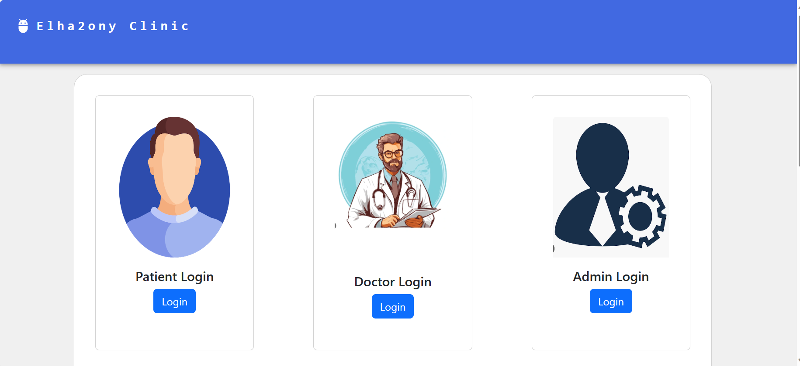
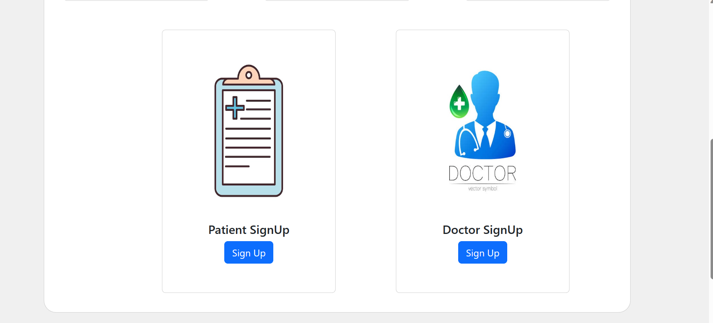
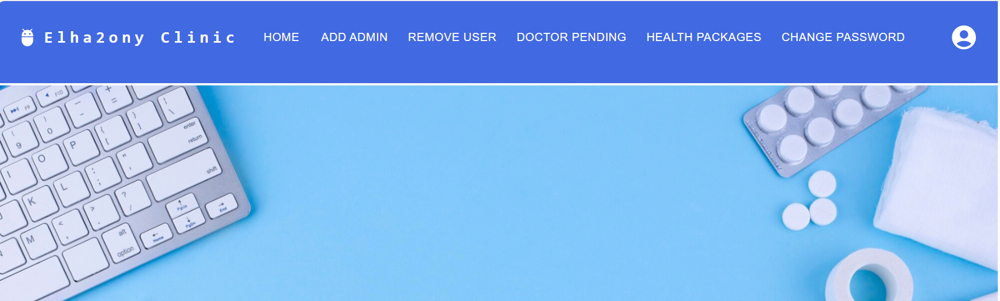
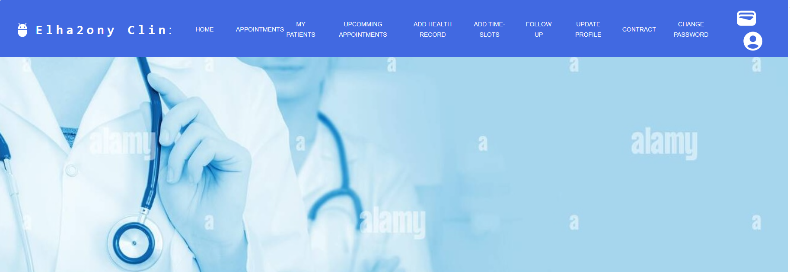
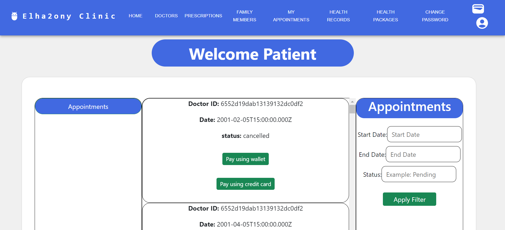

# El7a2ny - Virtual Clinic Management System
Welcome to El7a2ny, a comprehensive Virtual Clinic Management System designed to streamline healthcare interactions for clinics, doctors, and patients.

## Motivation
✨El7a2ny is here to make healthcare easy for everyone. ✨
 our project aims to simplify healthcare processes, providing an efficient and accessible platform for users to find doctors, schedule appointments, manage medical records ,and get medical prescriptions online.
 With El7a2ny, we're bringing a new level of ease and convenience to healthcare interactions. 😉

## Table of Contents

- [Build Status](#Build-Status)                     -->
- [code style](#code-style)                         
- [screenshots](#screenshots)                        
- [Tech/Framework Stack](#Tech/Framework-used)    
- [Features](#Features)                           
- [Code Examples](#Code-Examples)                 
- [configuration](#configuration)                 
- [Installation](#installation)                   
- [API reference](#API-reference)                      -->
- [Tests](#Tests)                                 
- [How to Use?](#How-to-Use?)
- [Contributing](#contribute)
- [Credits](#credits)
- [License](#license)


## Build Status
  

## Code Style

This project adheres to the following code style guidelines:

1. **Naming Conventions**: 
- For Variables and function names, Use camelCase.

2. **Comments**:
- Add comments before functions and complex logic to explain their purpose.
- Keep comments concise and informative.

3. **File Organization**
- The project is organized into the following main directories:
  - `server`: Backend server code.
  - `client`: Frontend React application.

4. **Version Control**
- Use Git for version control.
- Write clear and concise commit messages following [Conventional Commits](https://www.conventionalcommits.org/) guidelines.

5. **Whitespace**:
- Use whitespace to make the code more readable. There should be whitespace around operators and after commas.

6. **Coding Standards**
- Follow the [Airbnb JavaScript Style Guide](https://github.com/airbnb/javascript) for our JavaScript/React code.

Please ensure your code adheres to these guidelines before submitting a pull request.

## screenshots

### Main Registeration page






Description: First landing page for users; dual signup for doctors and patients, with sign-in options for doctors, patients, and admins.


### Admin HomePage





Description: The admin homepage offers a centralized dashboard. Access key features conveniently from your personalized dashboard, including adding administrators, removing users, handling doctor requests, managing health packages, and updating your password for secure account control.


### Doctor HomePage





Description: Doctors can navigate through a specialized toolbar with options such as managing appointments, viewing patients, scheduling follow-ups, updating their profiles, and more. 


### Patient HomePage


Description: Centralized access to patient options via a top bar including Doctors Prescriptions, Family Members, My Appointments, Health Records, Health Packages, Change Password, View Wallet, and Logout.


### View all doctors


Description: Explore a comprehensive table featuring doctors, with options to filter by specialty and available slots. Use the search function to quickly find specific doctors.


### Appointment History





Description: Display the patient's appointment history, with options to filter by appointment date or status. 


## Tech/Framework used

El7a2ny is built using the MERN (MongoDB, Express.js, React, Node.js) stack.

- Tool:
    - VS code
    
- Frontend:
    - React
    - Bootstrap
    - Material-UI

- Backend:
    - Node.js  v18.18.0.
    - Express.js
    - MongoDB
    
## Features

### Doctors

- **Authentication and Profile Management:**
  - Login/logout.
  - Change password.
  - Update email, hourly rate, or affiliation (hospital).

- **Health Records and Appointments:**
  - View patient information and health records.
  - Add new health records for patients.
  - Start/end video calls with patients.
  - Manage prescriptions (add/delete medicine, update dosage).
  - Schedule follow-up appointments.
  - View a list of all patients.
  - Search for a patient by name.
  - Reschedule appointments for patients.
  - Accept/revoke follow-up session requests from patients.
  - View wallet balance.
  - Chat with patients.

### Patients

- **Authentication and Profile Management:**
  - Register as a patient.
  - Login/logout.
  - Change password.
  - Add family members.
  - Link family members' accounts.
  - View registered family members.

- **Health Records and Appointments:**
  - Upload/remove medical history documents.
  - View health records.
  - View prescriptions.
  - Choose payment method for appointments and prescriptions.
  - View upcoming/past appointments.
  - Reschedule/cancel appointments.
  - Receive appointment notifications.
  - Search for doctors by name and/or specialty.
  - View doctor details.
  - View available appointments.
  - Select appointment date and time.

- **Wallet and Payments:**
  - Receive a refund in the wallet.
  - View wallet balance.

- **Messaging:**
  - Chat with doctors.

### Admins

- **User Management:**
  - Add another administrator.
  - Remove a doctor/patient/administrator.

- **Doctor Registration and Approval:**
  - View information uploaded by a doctor.
  - Accept or reject a doctor's request to join.
  - Accept a request for doctor registration.

- **Health Packages:**
  - Add/update/delete health packages.
  - View status of health package subscriptions.
  - Cancel health package subscriptions.

- **System Notifications:**
  - Receive notifications of various system activities.

- **Search and Discovery:**
  - View a list of all doctors.
  - Search for a doctor by name and/or specialty.
  - Filter doctors by specialty and/or availability.
  - View doctor details.
  - View all available appointments of a selected doctor.

and much more to discover... 😊🚀

## Code Examples
here are some code examples for developers to have an overview about our implementation

#### register for a new user:
```
//create a new user and save it in our database

 const user = new UserModel({ username, password, type });
 await user.save();
```
#### login:
```
  //get user's information and compare it with the given

  const { name,  password } = req.body;
  const user=await UserModel.findOne({username:name});
  const passwordMatch=await bcrypt.compare(password,user.password);

  //create a token for the user and send t to his browser page 

  const token = createToken(user.username);
  res.cookie('jwt', token, { httpOnly: true, maxAge: maxAge * 1000 });
  return res.status(201).json({token:token})
```

#### book an appointment:
```
  //create a new appointment

  const appointment = new AppointmentModel({doctorId,patientId,date,status,type});

  //update and save the doctor's schedule

    const updatedDoctor = await DoctorModel.findOneAndUpdate(
      { "_id": doctorId },
      { $pull: { availableSlots: date } },
      { new: true } 
    );

  //save the appointment

  await appointment.save();

```
#### view health records:
```
  //get patient's information for thet database 

  const patientId = req.params.patientId;
  const patient = await PatientModel.findOne({ user: res.locals.userId });

  //send back the health_records

  const patientRecords = patient.health_records;
  res.status(200).json(patientRecords);
```

## Configuration

### 1. Database Connection

Before running the project, make sure to set up your database connection by adding your MongoDB connection string to the `.env` file located in the `server` directory. Here's an example:

```env
DB_CONNECTION=mongodb+srv://<username>:<password>@your_cluster_url/your_database_name
```
### 2. Admin Setup

To ensure smooth operation of the system, it's necessary to manually add at least one admin user to your database. This can be done using MongoDB Compass.

## Installation

Follow these steps to set up the project on your local machine:

1. **Clone the Repository:**
   ```bash
   git clone https://github.com/advanced-computer-lab-2023/Apollo-8-Clinic.git
   ```
   
2. **Open the Project in Visual Studio Code**

3. **choose view terminal and Setup the Server:**
```
cd sever
npm install
npm install mongoose node
```
4. **Start the Server:**
```
node index.js
```
5. **Open Another Terminal for the Client:**
```
cd client
npm install
npm install react react-dom
npm install react-bootstrap
npm install @mui/material @emotion/react @emotion/styled
```
6. **Start the Client Application:**
```
cd src
npm run dev
```
7. **Open any web browser and navigate to**
```
http://localhost:5173/
```

## API reference

#### GET /patient/getPrescriptions

- **Purpose**: Retrieve all prescriptions for the authenticated patient.
- **Authentication**: Required (Patient)
- **Parameters**: None
- **Response**: Array of prescription objects

#### GET /patient/docInfo/:id

- **Purpose**: Retrieve a specific doctor's information using his id.
- **Authentication**: Required (Patient)
- **Parameters**: doctor's id
- **Response**: Doctor object or error message

#### GET /patient/docInfo/:id

- **Purpose**: Retrieve information about a specific doctor.
- **Authentication**: Required (Patient)
- **Parameters**: `id` (Doctor ID)
- **Response**: Doctor object or error message

#### GET /patient/patientdetails/:patientID

- **Purpose**: Retrieve details about a specific patient.
- **Authentication**: Required (Patient)
- **Parameters**: `patientID` (Patient ID)
- **Response**: Patient object or error message

#### POST /doctor/addPrescription

- **Purpose**: Add a new prescription for a specific patient.
- **Authentication**: Required (Doctor)
- **Parameters**: `patientId` (Patient ID), `medicine` (Array of medicine objects)
- **Response**: New prescription object or error message

#### POST /patient/linkPatient/:patientID

- **Purpose**: Link a patient to another patient (family member).
- **Authentication**: Required (Patient)
- **Parameters**: `patientID` (Patient ID), `input` (Email or phone number of the patient to be linked), `relation` (Relation to the patient)
- **Response**: Success message or error message


## Testing with Postman
Before testing the API using Postman, make sure **Postman Installed**. Download and install [Postman](https://www.postman.com/downloads/).

Use these test cases to test your code using Postman:

#### **Create Patient (POST)**

- *Endpoint*: `http://localhost:8000/Patient/`

- *Body Request*:

```json
{
  "username": "john_doe",
  "name": "John Doe",
  "type": "patient",
  "email": "john@example.com",
  "password": "SecurePassword123",
  "birthDate": "1990-01-01",
  "gender": "male",
  "phone": "1234567890",
  "emergencyName": "Emergency Contact",
  "emergencyNo": "9876543210",
  "emergencyRel": "Family",
  "addresses": ["123 Main St"],
  "status": "active",
  "wallet": 100,
  "health_records": []
}
```
- *Expected Response*:
```json
{
  "_id": "some_generated_id",
  "name": "John Doe",
  "email": "john@example.com",
  "birthDate": "1990-01-01",
  "gender": "male",
  "phone": "1234567890",
  "emergencyName": "Emergency Contact",
  "emergencyNo": "9876543210",
  "emergencyRel": "Family",
  "addresses": ["123 Main St"],
  "status": "active",
  "wallet": 100,
  "health_records": []
}
```

#### **get Patient subscribed Health Package (GET)**

- *Endpoint*: `http://localhost:8000/Patient/getPatientHealthPackage/:id`

- *Body Request*:

```json
{}  // No request body for GET request
```
- *Expected Response*:
```json
[
  {
    "_id": "health_package_id",
    "name": "Gold",
    "price": 1500,
    "sessDiscount": 20,
    "medDiscount":10,
    "subDiscount":15
  }
] //or empty list []
```

#### **Get Health Records (GET)**

- *Endpoint*: `http://localhost:8000/Patient/health-records/${patientId}`

- *Body Request*:

```json
{}  // No request body for GET request
```
- *Expected Response*:
```json
[
  {
    "_id": "record_id_1",
    "date": "2023-01-10",
    "description": "Regular check-up",
    "image": "image_url_1"
  },
  {
    "_id": "record_id_2",
    "date": "2023-05-22",
    "description": "X-ray results",
    "image": "image_url_2"
  }
  // ... additional health records
]
```

#### **Book Appointment (POST)**

- *Endpoint*: `http://localhost:8000/appointment/`

- *Body Request*:

```json
{
  "doctorId": "doctor_id",
  "date": "2023-12-20",
  "status": "upcoming",
  "type": "Follow up"
}
```

- *Expected Response*:
```json
{
  "_id": "generated_appointment_id",
  "doctorId": "doctor_id",
  "patientId": "patient_id",  // patientId is fetched based on the authenticated user
  "date": "2023-12-20",
  "status": "scheduled",
  "type": "Follow-up"
}
```

#### **view patient Appointments (GET)**

- *Endpoint*: `http://localhost:8000/appointment/getPatientAppointments/${patientId}`

- *Body Request*:

```json
{}  // No request body for GET request
```

- *Expected Response*:
```json
[
  {
    "_id": "appointment_id_1",
    "doctorId": "doctor_id_1",
    "date": "2023-12-18",
    "time": "10:00",
    "status": "completed",
    "type": "regular"
  },
  {
    "_id": "appointment_id_2",
    "doctorId": "doctor_id_2",
    "date": "2023-12-22",
    "time": "14:30",
    "status": "upcoming",
    "type": "Follow up"
  }
  // ... additional appointments if any
]
```


## How to Use?

### As a Patient

1. **Access the Application**: Launch your web browser and enter the provided URL to reach the registration page.

2. **Registration**: Select "Patient Signup" to initiate the registration process. Complete the form with the necessary details and click "Submit".

3. **Dashboard Navigation**: Post-registration, you'll be redirected to the dashboard. The top bar serves as your primary navigation tool.

4. **Finding Doctors**: Click on "Doctors" to browse and search for doctors by specialty and availability.

5. **Viewing Prescriptions**: Select "Prescriptions" from the top bar to review prescriptions issued by your doctors.

6. **Managing Family Members**: Use the "Family Member" option to manage (view, add, or link) family members.

7. **Appointment Management**: Go to "My Appointments" to monitor your appointments. You can filter them by date or status.

### As a Doctor
1. **Access the Application**: Launch your web browser and enter the provided URL to reach the registration page.

2. **Registration**: Select "Doctor Signup" to initiate the registration process. Complete the form with the necessary details and click "Submit" to send your application for admin approval.

3. **Sign In**: Once your application is approved, return to the main page and sign in.

4. **Dashboard Navigation**: Use the top navigation bar to access various features such as viewing your wallet balance, updating your information, adding a prescription, managing appointments, adding available slots, adding patient health records, viewing follow-ups, and reviewing your contract.

### As an Admin
1. **Sign In**: Use the pre-configured credentials stored in the database to sign in.

2. **Dashboard Navigation**: Post sign-in, you'll be redirected to the dashboard.

3. **Admin Management**: Use the top bar to navigate through various admin tasks such as adding a new admin, removing a user, managing doctor's requests, and managing health packages.


## Contribute

We welcome contributions from everyone. Here's how you can contribute:

1. **Fork the Repository**: Start by forking the repository to your own GitHub account.

2. **Clone the Repository**: Clone the forked repository to your local machine.

3. **Create a New Branch**: Always create a new branch for each feature or bug fix you are working on. Never work directly on the `main` branch.

4. **Make Your Changes**: Make your changes or additions in your branch. Be sure to follow the existing code style.

5. **Commit Your Changes**: Commit your changes with a clear and concise commit message.

6. **Push to GitHub**: Push your changes to your fork on GitHub.

7. **Submit a Pull Request**: From your fork, submit a pull request to the `main` branch of the original repository. Describe your changes in the pull request. Link any related issues or pull requests.

- Communication Channels: If you have questions or need clarification, feel free to reach out to us on [Discord](https://discord.com/channels/@nadaemad222) or by opening an issue on GitHub. We value open communication and are here to help!

## Credits

This project was made possible thanks to the following resources and contributions:

1. **Node.js**: The Node.js tutorial playlist on YouTube ``https://www.youtube.com/playlist?list=PLZlA0Gpn_vH_uZs4vJMIhcinABSTUH2bY``provided a comprehensive guide to using Node.js in the project.

2. **Express.js**: This Express.js tutorial video on YouTube ``https://www.youtube.com/watch?v=fgTGADljAeg`` was instrumental in understanding and implementing Express.js.

3. **React Introduction**: The React introduction playlist on YouTube ``https://www.youtube.com/playlist?list=PLZlA0Gpn_vH_NT5zPVp18nGe_W9LqBDQK`` provided a solid foundation for using React in the project.

5. **Contributors**: A special thanks to all the contributors who have helped to improve this project with their suggestions, bug reports, and code contributions.


## License

This project is licensed under the terms of the MIT license. See the [LICENSE](https://opensource.org/licenses/MIT) file for details.

The credit card form in this project utilizes the Stripe library, which is subject to its own license. Please review the [Stripe Terms of Service](https://stripe.com/terms) and [Stripe Legal](https://stripe.com/legal) for details.

This project uses the Bootstrap framework, which is licensed under the [MIT License](https://opensource.org/licenses/MIT). For more information, see the [Bootstrap License](https://github.com/twbs/bootstrap/blob/main/LICENSE).

The project utilizes Material-UI components, a library licensed under the [MIT License](https://opensource.org/licenses/MIT). For more information, see the [Material-UI License](https://github.com/mui-org/material-ui/blob/next/LICENSE).

This project is licensed under the terms of the [Apache License 2.0](https://opensource.org/licenses/Apache-2.0). See the [LICENSE](LICENSE) file for details.

